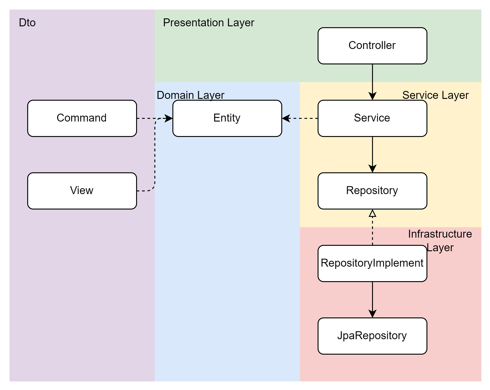
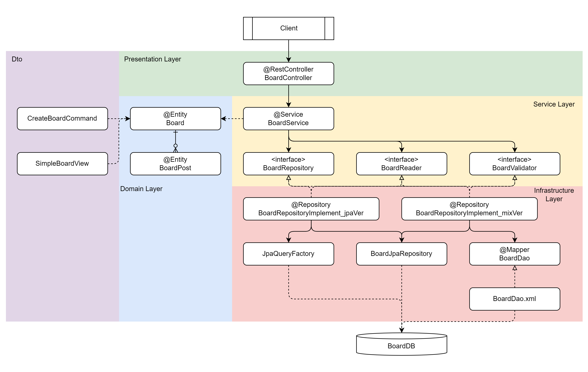

# 구성 정보
- Java 21 
  - JDK 선택시, corretto-21을 추천합니다.
    - [[공식 설치 가이드 위치]](https://docs.aws.amazon.com/corretto/latest/corretto-21-ug/downloads-list.html)(https://docs.aws.amazon.com/corretto/latest/corretto-21-ug/downloads-list.html)
        - corretto는 AWS에서 제공하는 OpenJDK로, 오라클에서 지원하는 것과 인터페이스가 동일하나, 더 경량화되고 안정적인 구현을 갖고 있습니다.
    - IntelliJ에서는 더 간단히 다운로드 및 환경설정 가능합니다.
      - File -> Project Structure -> Project -> Project SDK -> Add SDK -> Amazon Corretto 21
    - IntelliJ가 아니라면, 다음과 같은 환경변수 설정이 필요할 수 있습니다.
      - JAVA_HOME : C:\Program Files\Amazon Corretto\jdk-21
      - Path : %JAVA_HOME%\bin
- Spring Boot 3.3.2
- Gradle 8.x
- MySQL, MSSQL, H2 Database 모두 가능하도록 작성
  - build.gradle, application.yml 에서 설정 변경 가능
    - 처음 확인시, h2로 확인해보세요 (주석처리 해둠)
    - h2는 메모리 DB로, 서버 재시작시 데이터가 초기화됩니다.
- MyBatis, JPA, QueryDsl 예제 모두 작성
- 테스트 작성
  - 도메인 테스트 (단위 테스트)
  - 서비스 테스트 (h2를 이용한 통합 테스트)
- [스프링부트_기초_가이드](./docs/스프링부트_기초_가이드.pdf)
  - 다운로드 받아 보시길 권장드립니다.

# Layered Architecture
- 도메인을 갖는 레이어드 아키텍처는 다음 그림과 같습니다.


## Presentation Layer (Controller)
- presentation 패키지
- 사용자와의 상호작용을 담당
- 사용자의 요청을 받아 처리하고, 응답을 사용자에게 전달
- 사용자의 요청을 처리하기 위해 Application Layer에게 요청을 전달

## Service Layer (Service)
- domain 패키지 (application 패키지를 따로 두기도..)
- 사용자의 요청을 처리
- 사용자의 요청을 처리하기 위해 Domain Layer에게 요청을 전달

## Domain Layer (Entity)
- domain 패키지
- 비즈니스 로직을 담당
- **데이터의 비즈니스적 유효성을 검증**하고, 데이터의 상태를 변경
- 데이터의 상태를 변경하기 위해 Infrastructure Layer에게 요청을 전달

## Data Transfer Object (Dto)
- domain 패키지 (필요한 각 레이어마다 위치시키기도..)
- 데이터 전송을 담당
- 데이터를 Presentation Layer와 Domain Layer, Infrastructure Layer 간에 전달
- 생성자에서 데이터를 초기화하고 불변하게 관리하는 것(record)을 지향
- 생성자에서 **데이터 타입과 값에 대한 검증**을 수행

## Infrastructure Layer (Repository)
- infrastructure 패키지
- 데이터의 상태를 변경
- 데이터베이스에 데이터를 저장하거나, 데이터베이스로부터 데이터를 조회



# API 명세
- Swagger를 이용하여 API 명세를 작성
  - localhost:8080/swagger-ui/index.html
## API를 도커에서 사용시, 주의사항
- 도커에서 실행시, localhost가 아닌 도커 컨테이너의 IP로 접근해야 합니다.
  - 때문에, 프런트 엔드로부터 API를 호출할 때, 도커 컨테이너의 IP로 호출해야 합니다.
  - 이는 CORS를 허용해주어야 합니다.
  - 다음과 같은 해결 방안이 있습니다.
    - (운영환경이 클라우드 또는 쿠버네티스 이용시, 제공하는 기능을 활용하세요)
### 1. CORS 설정
- 모든 애플리케이션마다, 모든 각각의 환경에 따라, 
  - 각각의 애플리케이션에 CORS 설정을 해줍니다.
- application.yml에 다음과 같이 설정해주어야 합니다.
  - 스프링 프로파일을 활용하시길 바랍니다.
```yml
spring:
  cors:
    allowed-origins: "*"
```
### 2. 리버스 프록시 설정
- 리버스 프록시(nginx)를 이용하여, 
  - 동일한 호스트명으로써, 도커 컨테이너의 IP로 접근하도록 설정할 수 있습니다.
  - nginx.conf로 한곳에서 한번에 관리할 수 있습니다.

